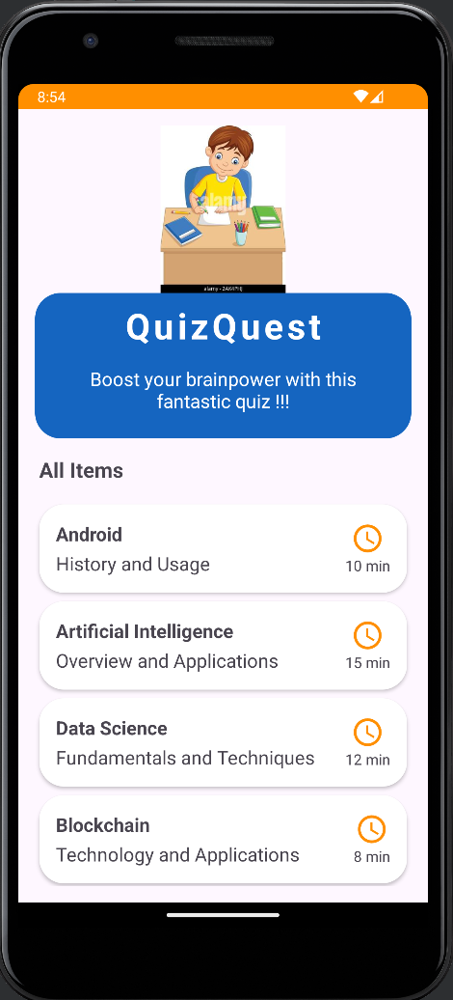
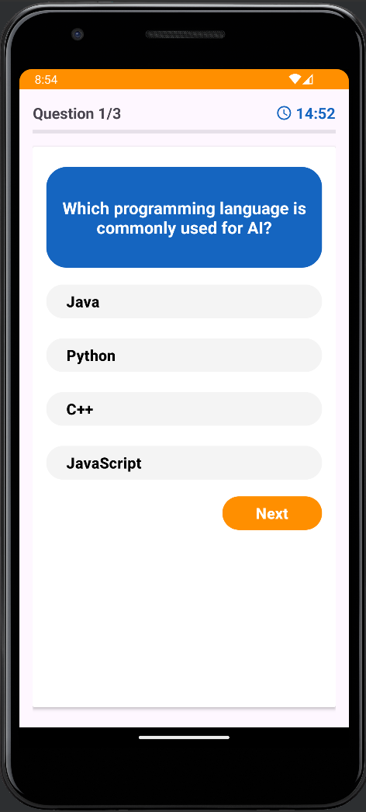
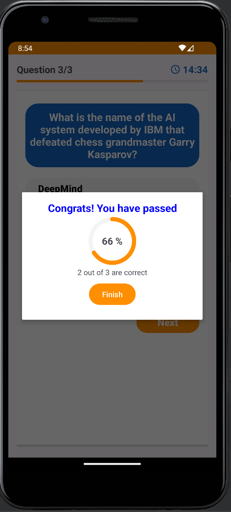

# QuizQuest App

## Introduction
The QuizQuest App is an interactive quiz platform designed to provide users with an engaging way to test their knowledge on various topics. This repository contains the Android application along with its associated Firebase Realtime Database for managing quizzes and displaying quiz results. With Firebase Realtime Database integration, the app can efficiently store and retrieve quiz data, user scores, and other relevant information directly from the cloud, enabling real-time updates and seamless interaction for users.

# Features
- **Quiz Taking:** Users can take quizzes on different subjects and topics.

## Screenshots
  

## Getting Started
### Prerequisites
- Android Studio 2020.3.1 (Arctic Fox) or newer.
- Kotlin plugin installed.
- Min Android SDK version 24.

## Installation
**Clone this repository:**
```
git clone https://github.com/yourgithub/quizquest.git

```
**Open the project in Android Studio.**

**Sync Gradle and build the project.**

## Using the App
Start by exploring the available quizzes and selecting one to take. Answer the quiz questions and submit your answers to see your score. Track your progress through the leaderboard and quiz history.

## Sample App
The provided sample app demonstrates how to use the QuizQuest App. Dive into the app to experience its functionality and discover its potential applications.

## Running the Sample App
Open the project in Android Studio.
Select a device or emulator.
Run the application.

# Support
If you encounter any issues or have questions, please contact [your email address].

# Contributing
Contributions are welcome! Please read our Contributing Guide for more information on making pull requests.

# License
This project is licensed under the MIT License - see the LICENSE file for details.
